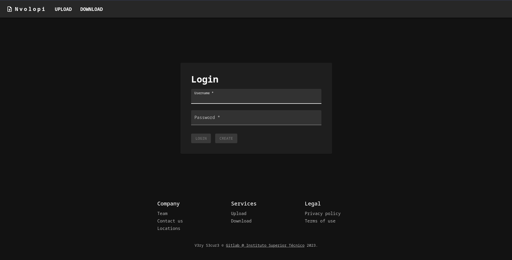
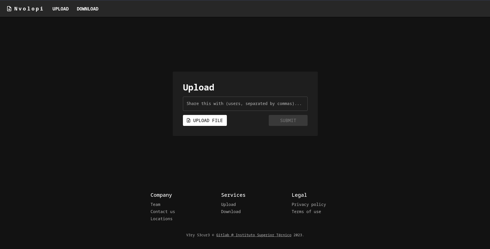
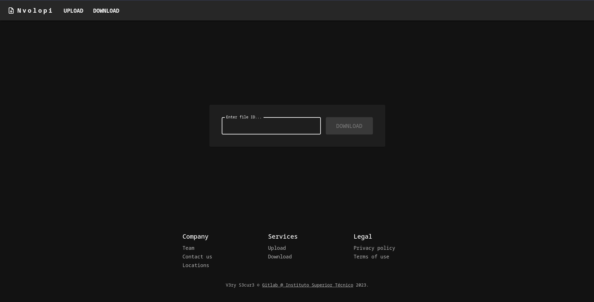
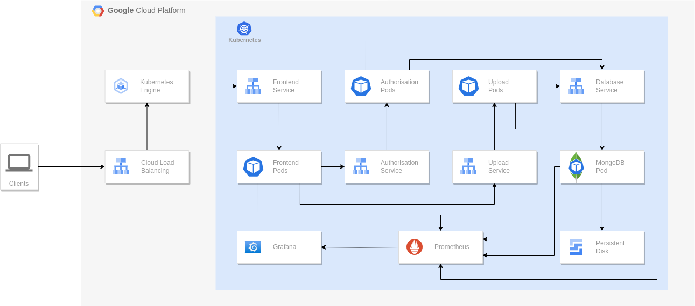

# Nvolopi: a blazingly fast, ultra lightweight cloud-native file transfer application

Nvolopi is a file transfer system, akin to popular applications like WeTransfer. A user, after signing in, can upload files and share them with a specified group of users via a unique ID, who can then download it after introducing that ID.

## Web UI

Authentication UI  


Upload UI


Download UI


## Architecture



## Project Structure

- [frontend](./frontend/) contains the Dockerfile, nginx config and source code for the frontend service
- [services](./services/) contains the backend service files
    - [auth](./services/auth/) contains the Dockerfile, env variables and source code for the authentication service
    - [upload](./services/upload/) contains the Dockerfile, env variables and source code for the upload/download service
- [infra](./infra/) contains the scripts to test and deploy the infrastructure
    - [scripts](./infra/scripts/) contains a script to stress test the infrastructure and trigger autoscale and a script to push docker images to google cloud registry
    - [k8s](./infra/k8s/) contains the scripts to deploy the infrastructure
        - [root](./infra/k8s/) contains the Vagrantfile and its bootstrap script, the main and provider Terraform scripts
        - [gcp_gke](./infra/k8s/gcp_gke/) contains the top level resources (cluster, node_pool, persistent disk) and relevant outputs for k8s
        - [gcp_k8s](./infra/k8s/gcp_k8s/) contains all the scripts related to kubernetes including services, deployments, monitoring, etc
        
## Deployment

The [Vagrantfile](/infra/Vagrantfile) describes the configuration for the management node which is responsible for deploying the entire infrastructure to the Google Cloud.

To deploy the application follow these steps:
1. Create a GCP project
2. Activate the Google Compute Engine and Google Kubernetes Engine APIs
3. Go to IAM->Service Accounts, select the compute engine service account and generate a credentials file in JSON format.
4. Copy `terraform.tfvars.example` to `terraform.tfvars` and change the path to the credentials file to the file obtained in step 3.
5. Run the following commands:
```bash
cd infra/k8s
vagrant up
vagrant ssh ssh

 # Deploy infrastructure
terraform init
terraform plan -out="terraform-plan"
terraform apply "terraform-plan"

# Destroy infrastructure
terraform destroy
# Destroy management node
vagrant destroy
```